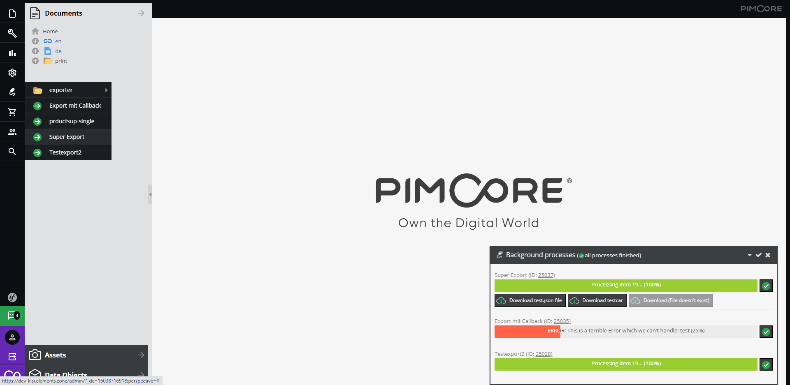
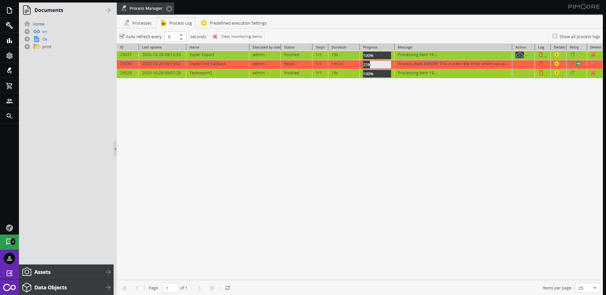
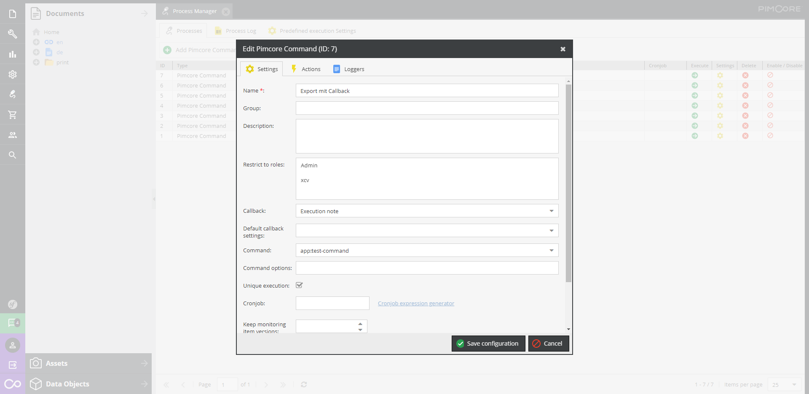
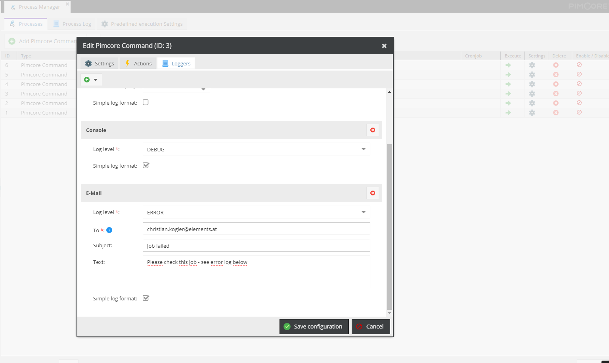

# ProcessManager (Pimcore 6 compatible)

The Process Manager allows you to manage (define,execute...) arbitrary processes/commands in the Pimcore backend. 
You can display the execution progress of the script in the admin interface and the user can view the detailed log information. 
In addition you can define "actions" - e.g. download of a file after the process has finished. Furthermore callback actions 
are available (custom settings which the user can define for runtime execution) and the processes are monitored (you get an email if a process dies)

***Key features:***
- Execute custom script in background
- Report the current execution state to the customer in the Pimcore admin
- Define loggers (email, file, application logger)... per process
- View detailed debug log information in the Pimcore admin
- Scripts are monitored and you will receive an email if a job fails
- Provide custom actions after a job has finished (e.g download a file)
- Define custom Callback-Windows to provide the user the ability to define runtime execution options
- Store/Manage CallbackSettings and reuse them at execution time
- Define/execute the scripts as cronjobs 
- Support multiprocessing (execute multiple processes parallel)

## Topics
* [Installation & updates](./doc/installationAndUpdates.md)
* [Configuration](./doc/configuration.md)
* [Getting started (basics)](./doc/gettingStarted.md)
* [Callbacks (Configuration windows)](./doc/callbacks.md)
* [Actions](./doc/actions.md)
* [Meta data files](./doc/metaDataFile.md)
* [Rest API](./doc/restApi.md)
* [How to use - Parallelization](./doc/usageParallelization.md)
* [Migration from Pimcore 4 to Pimcore 5](./doc/migration.md)

***First impressions:***

Job execution by user:

Job execution state:

Job configuration:

Define Loggers per process / job:

Callback settings (user defined runtime settings):

