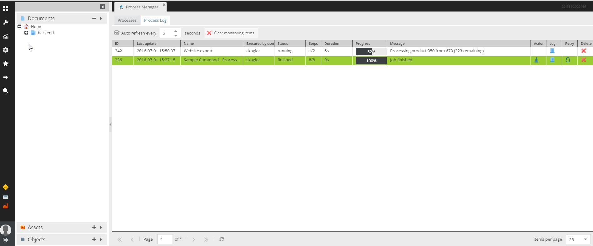
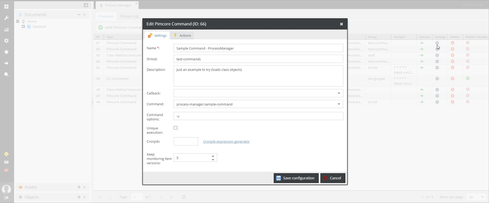

# ProcessManager

*Key features*
- Execute custom script in background
- Report the current execution state to the customer in the Pimcore admin
- View detailed debug log information in the Pimcore admin
- Scripts are monitored and you will receive an email if a job fails
- Provide custom actions after a job has finished (e.g download a file)
- Define custom Callback-Windows to allow the user to define runtime execution options
- Store/Manage CallbackSettings and reuse them at execution time


The ProcessManager allows you to manage (define,execute...) arbitrary processes/commands in the Pimcore backend. You can display the execution progress of the script in the Admin interface and the user can view the detailed log information. In addition you can define "actions" - e.g. a download of a file after the process has finished. Furthermore callback actions are available and the processes are monitored (you get an email if a process dies)

Job execution state:


Job Management


Callback settings:


Shortcut menu:


## Installation
**Be careful, normally there's already a `require` node, so you need to add the new line at the bottom**     
```
composer require elements/process-manager-bundle
```

Run composer update: 
`composer update`

After the installation you have a config file located in /website/config/plugin-process-manager.php

By default the processes are checked when the pimcore maintenance is executed. It is advisable to set up a extra cronjob, which monitors the script execution.

Just add the following command to your crontab (and set "executeWithMaintenance" to "false" in the config file ;-))
```
*/5 * * * * php /home/tyrolit-pim/www/pimcore/cli/console.php process-manager:maintenance
```

### Configuration
The configuration is done by the file /website/config/plugin-process-manager.php

It looks like this
```php
<?php
$systemConfig = \Pimcore\Config::getSystemConfig()->toArray();
return [
    'general' => [
        "archive_treshold_logs" => 7, //keep monitoring items for x Days
        'executeWithMaintenance' => true //do execute with maintenance (deactivate if you set up a separate cronjob)
    ],
    'email' => [
        'recipients' => explode(';',(string)$systemConfig['applicationlog']['mail_notification']['mail_receiver']), //gets a reporting e-mail when a process is dead
    ],
    "executorClasses" => [
        [
            "class" => "\\ProcessManager\\Executor\\PimcoreCommand"
        ],
        [
            "class" => "\\ProcessManager\\Executor\\CliCommand"
        ],
        [
            "class" => "\\ProcessManager\\Executor\\ClassMethod"
        ]
    ],
    "executorLoggerClasses" => [
        [
            "class" => "\\ProcessManager\\Executor\\Logger\\File"
        ],
        [
            "class" => "\\ProcessManager\\Executor\\Logger\\Console"
        ],
        [
            "class" => "\\ProcessManager\\Executor\\Logger\\Application"
        ]
    ],
    "executorActionClasses" => [
        [
            "class" => "\\ProcessManager\\Executor\\Action\\Download"
        ]
    ],
    "executorCallbackClasses" => [
        [
            "name" => "example",
            "class" => "\\ProcessManager\\Executor\\Callback\\General",
            "extJsClass" => "pimcore.plugin.processmanager.executor.callback.example",
        ],
        [
            "class" => "\\ProcessManager\\Executor\\Callback\\ExecutionNote"
        ],
        [
            "name" => "exportProducts",
            "class" => "\\ProcessManager\\Executor\\Callback\\General",
            "extJsClass" => "pimcore.plugin.windhager.processmanager.executor.callback.exportProducts",
        ]
    ]
];
```
### Usage

**In short: The \ProcessManager\Console\Command\SampleCommand.php is a working example how you should use the plugin.**

Details: When a script is executed via the Pimcore admin interface a monitoring item is created and the id of the monitoring item is passed to the cli script (Param: monitoring-item-id).
You will have to retrieve this id in your script and call the initProcessManager() function of the \ProcessManager\ExecutionTrait. 

Example of a Pimcore command
```php
<?php
namespace Website\Console\Command;

use Pimcore\Console\AbstractCommand;
use Symfony\Component\Console\Input\InputInterface;
use Symfony\Component\Console\Input\InputOption;
use Symfony\Component\Console\Output\OutputInterface;

class SampleCommand extends AbstractCommand {

    use \ProcessManager\ExecutionTrait;

    protected function configure()
    {
        $this
            ->setName('website:my-command')
            ->setDescription("The description...")
            ->addOption(
                'monitoring-item-id', null,
                InputOption::VALUE_REQUIRED,
                "Contains the monitoring item if executed via the Pimcore backend"
            );
        ;
    }

    protected function execute(InputInterface $input, OutputInterface $output)
    {
        $monitoringItem = $this->initProcessManager($input->getOption("monitoring-item-id"),[
 //'published' => false, //<- hide log entry in admin interface
            'totalSteps' => 2,
            'autoCreate' => true,
        ]);

        /**
         * Afer you called initProcessManger(...) you can retrieve the monitoring item from anywhere with \ProcessManager\Plugin::getMonitoringItem()
         */


        $monitoringItem->setCurrentStep(1)->setMessage('Just going to do something')->save();
        //using the logger
        $monitoringItem->getLogger()->debug('Testmessage');

        //do your work and updates here...
        $monitoringItem->setCurrentStep(1)->setWorkloadCompleted()->setMessage('Done -> moving on')->save();

        $monitoringItem->setCurrentStep(2)->setMessage('Cleaning up something')->save();
        $monitoringItem->setMessage('Finished')->setCompleted();
    }
}
```

## Callbacks

Callbacks are configuration windows/forms which are displayed before a process is executed. This allowes the user to configure certain runitme options. 
The selected values are stored in the monitoring item and can be retrieved by calling 

```php
$callbackSettings = $monitoringItem->getCallbackSettings();
```

A "Callback" can be defined on each process  ("Settings" -> "Callback"). To create a new custom callback you have to add an entry to the "executorCallbackClasses" array in the config. 
A entry could look like this:

```php
[
            "name" => "exportProducts",
            "class" => "\\ProcessManager\\Executor\\Callback\\General",
            "extJsClass" => "pimcore.plugin.PLUGINNAME.processmanager.executor.callback.exportProducts",
]
```

For most use cases you just have to provide a unique "name" and a extJsClass which is responsible to open the window.
The ExtJs Class sould extend the pimcore.plugin.processmanager.executor.callback.abstractCallback and implement a "getFormItems" method which returns the configuration fields.

The abstract callback Class implements certain helpers to easily add new form elements. Please take a look at  **/ProcessManager/static/js/executor/callback/example.js**. This class demonstrates how to add the provided fields. Of course you can add your own custom fields as well.

The example.js file provides a callback window like this:


## Rest-API

The Process Manager also provides a rest service to start jobs...


**URL: http://YOUR-DOMAIN/plugin/ProcessManager/rest/execute**
 
Executes a job by an ID or by the name. 

| Parameter | Type | Description |
| ----- | ------| ----------- |
| "id" or "name" | mandatory | ID or name of the configuration to execute |
| "callbackSettings" | optional | A Json or Xml string which is stored as the callbackSettings in the monitoring item |

It returns the monitoring item ID to check the process state...
**Example:**
```json
{
  "success": true,
  "monitoringItemId": 123
}
```

**URL: http://YOUR-DOMAIN/plugin/ProcessManager/rest/monitoring-item-state**
 
Returns the state of a process by the monitoring item id

| Parameter | Type | Description |
| ----- | ------| ----------- |
| "id"| mandatory | ID of the monitoring item |

It returns the monitoring item ...
**Example:**
```json
{
"success": true,
"data": {
"id": 59419,
"name": "Test",
"message": "Finished export",
"status": "finished",
"creationDate": "1488797851",
"configurationId": "9",
"reportedDate": null,
"modificationDate": "1488797891",
"pid": null,
"loggers": [
{
"logLevel": "DEBUG",
"simpleLogFormat": "on",
"class": "\\ProcessManager\\Executor\\Logger\\Console"
},
{
"logLevel": "DEBUG",
"filepath": "",
"simpleLogFormat": "on",
"class": "\\ProcessManager\\Executor\\Logger\\File"
}
],
"actions": [
{
"accessKey": "download",
"filepath": "/website/var/tmp/testfiles-59419.txt",
"deleteWithMonitoringItem": true,
"class": "\\ProcessManager\\Executor\\Action\\Download"
}
],
"executedByUser": 19,
"logger": {},
"callbackSettings": {
"firstName": "Max",
"lastName": "Musterman"
},
"totalWorkload": "100",
"currentWorkload": "100",
"currentStep": "1",
"totalSteps": "1"
}
}
```


### Main components
The plugin consists of 6 main components.

| Component | Description |
| ----- | ----------- |
| Monitoring Item | In your script you will have a monitoringItem which holds the state/messages/loggers... most of the time you will just interact with the monitoring item. |
| Executor Classes | A executor Class is responsible to create and execute the Command in the background. |
| Executor Callback Classes | A callback Class is responsible to provide a configurtation window in the pimcore admin where the user can define arbitrary configurations  |
| Executor Action Classes | A Action Class is responsible to execute a certain action (e.g. provide a Download button) after the job has finished.  |
|Predefined callback settings  |  Allows you to configure/store predefined configuration sets which can be selected at execution time |
|Loggers  |  Allows you to add loggers (Console,File..) |
### MonitoringItem 

| Method| Description |
| ----- | ----------- |
| setMessage("my message")| Sets a short message which is displayed in the admin. The message is automatically logged to the logs - if you don't want to log the message, pass "false" as second parameter   |
| getLogger()|  Returns the logger.  Currently a File/Stream and Application Logger is returned. May be configurable in future. 
|setTotalSteps(10)| Total steps |
|setCurrentStep(1)| The current processing step|
|setTotalWorkload(100)| The workload which has to be perfomed for the current step|
|setCurrentWorkload(10)| Current work processed|
|setCompleted()|Helper to set the job to "finshed"|


### Executor Classes 

| Class| Description |
| ----- | ----------- |
| \ProcessManager\Executor\CliCommand | Executes a custom cli command  |
|\ProcessManager\Executor\PimcoreCommand |  Executes a pimcore command |
|\ProcessManager\Executor\ClassMethod  | Initializes a Class and calls a method  |
|\ProcessManager\Executor\ExportToolkit | Provides a list of ExportToolkit Configurations which can be executed | 

### Action Classes

| Class| Description |
| ----- | ----------- |
| \ProcessManager\Executor\Action\Download| Provide a download after a job has finished  |


### Callback Classes

| Class| Description |
| ----- | ----------- |
| \ProcessManager\Executor\Callback\ExecutionNote | Just an easy callback (provide a text note field) to get started. Callback classes are always job specific ;-)  |

### Logger Classes 

| Class| Description |
| ----- | ----------- |
| File | Logs the messages to a file. If no file path is specified, the logs are written to  /website/var/log/process-manager/(MonitoringItem-ID).log |
|Console |  The messages are logged to the php stdout (for cli execution) |
|Application  | The messages are logged to the Application-Logger. The name of the Configuration is used as component name  |

If "Simple log format" is checked, the Context-Information is omitted (cleaner log messages -> useful for File and Console Logger)
