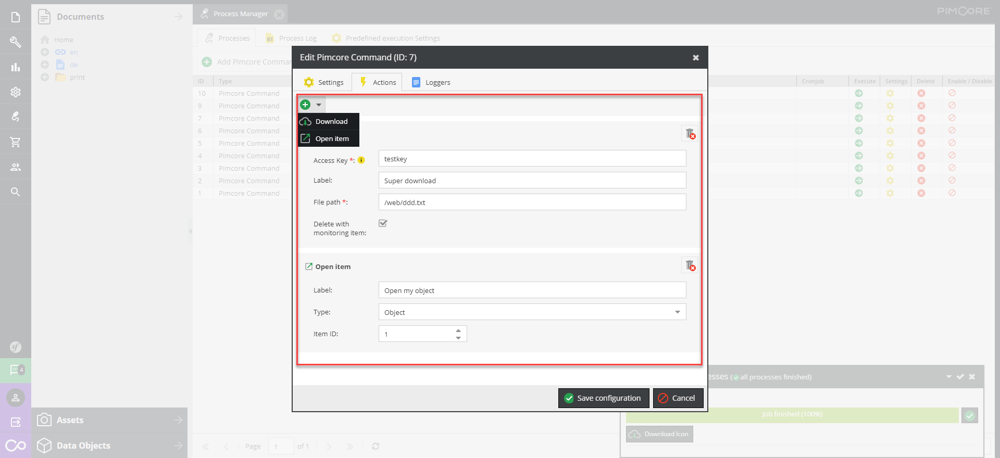
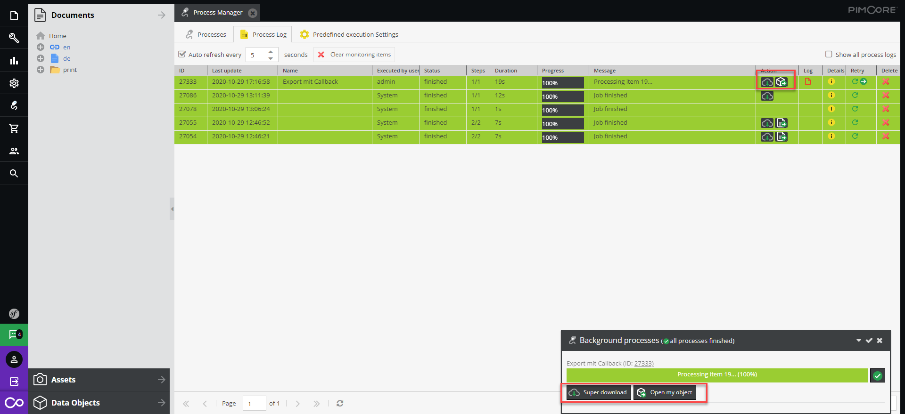

# Actions

Actions are some kind of tasks which should be performed after a process has been finished... 
E.g. let the user download a file.

Therefore you can define certain actions in the "Actions" Tab.


These actions are then shown in the "active processes panel" and in the Logs


Sometimes you want to set these actions programmatically. This can be done with:

```php
use \Elements\Bundle\ProcessManagerBundle\Executor\Action;
#...


$downloadAction = new Action\Download();
$downloadAction
    ->setAccessKey('myIcon')
    ->setLabel('Download Icon')
    ->setFilePath('/web/bundles/elementsprocessmanager/img/sprite-open-item-action.png')
    ->setDeleteWithMonitoringItem(false);

$openItemAction = new Action\OpenItem();
$openItemAction
    ->setLabel('Open document')
    ->setItemId(1)
    ->setType('document');

$monitoringItem->setActions([
    $downloadAction,
    $openItemAction
]);

$monitoringItem->save();
```

## Action Types:
### Download
Provides a download button after the process has been finished. 
Programmatically creation: 

```php
$downloadAction = new Action\Download();
$downloadAction
    ->setAccessKey('myIcon')
    ->setLabel('Download Icon')
    ->setFilePath('/web/bundles/elementsprocessmanager/img/sprite-open-item-action.png')
    ->setDeleteWithMonitoringItem(false);
$monitoringItem->setActions([
    $downloadAction
]);

$monitoringItem->save();
```

### Open Item
The "Open item" shows a button after the process is finished with which the user can open an object/document/asset. 

Programmatically creation: 

```php

$openItemAction = new Action\OpenItem();
$openItemAction
    ->setLabel('Open document')
    ->setItemId(1) //id of the document/object/asset
    ->setType('document');
$monitoringItem->setActions([
    $openItemAction
]);

$monitoringItem->save();
```
### JS Event
The JS Event fires a custom javascript event. In your Bundle you can perform custom actions... 
Lets assume you add an event with the event name "export.sayHello".
Your Javscript part to hook into this event could be:

```javascript
pimcoreReady: function (params, broker) {
        document.addEventListener('export.sayHello', function (e) {
            let detail = e.detail;
            let source = detail.source;
            let monitoringItem = detail.monitoringItem;
            let actionData = detail.actionData;
            let actionButtonPanel = detail.actionButtonPanel;
            let obj = detail.obj;
            let index = detail.index;

            //click in active process list
            if(source == 'activeProcessList'){
                if(monitoringItem.status == 'finished'){
                    let button = Ext.create('Ext.Button', {
                        text: actionData.label || 'Super Button',
                        icon : actionData.icon || '/bundles/pimcoreadmin/img/flat-color-icons/biohazard.svg',
                        style: (index > 0 ? 'margin-left:5px;' : ''),
                        scale: 'small',
                        handler: function() {
                            let eventData = actionData.eventData;
                            let data = null;
                            if(eventData){
                                data = Ext.decode(eventData);
                            }
                            console.log('Custom data:');
                            console.log(data);
                            alert('Hello from custom event :-)')
                        }
                    });
                    actionButtonPanel.items.add(button);
                }
            }

            //click from grid
            if(source == 'gridList'){
                if(monitoringItem.status == 'finished'){
                    let eventData = actionData.eventData;
                    let data = null;
                    if(eventData){
                        data = Ext.decode(eventData);
                    }
                    console.log('Custom data:');
                    console.log(data);
                    alert('Hello from custom event - Grid view :-)')
                }

            }


        }, false);
    }
``` 
