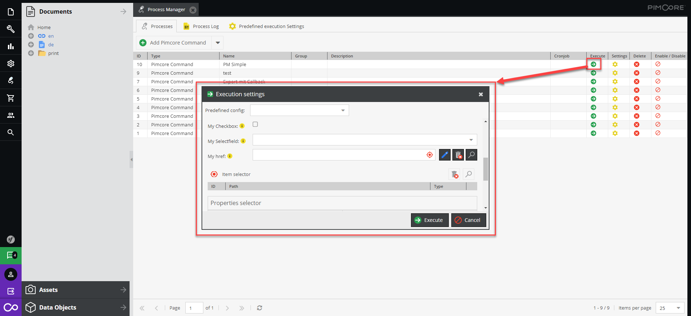
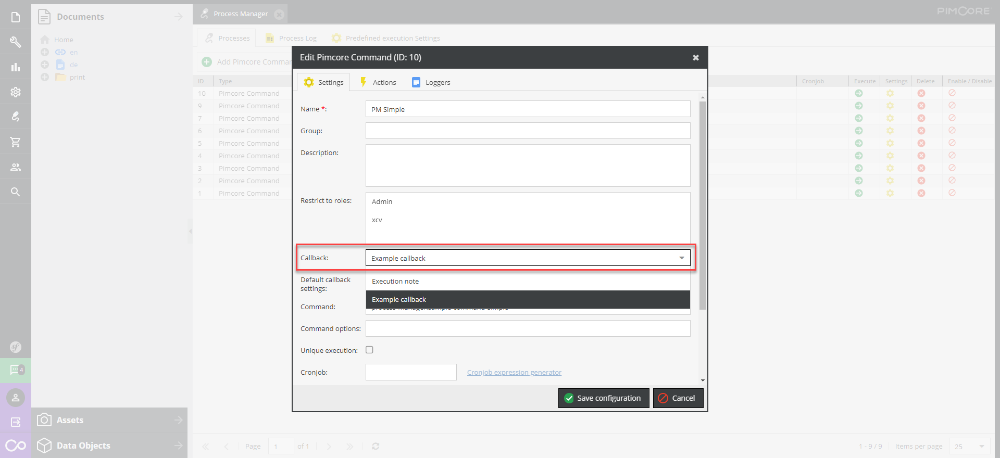
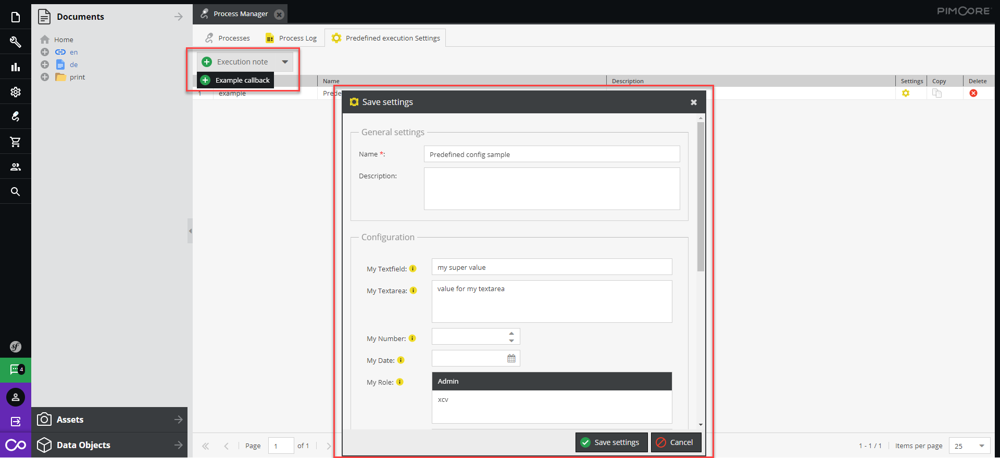
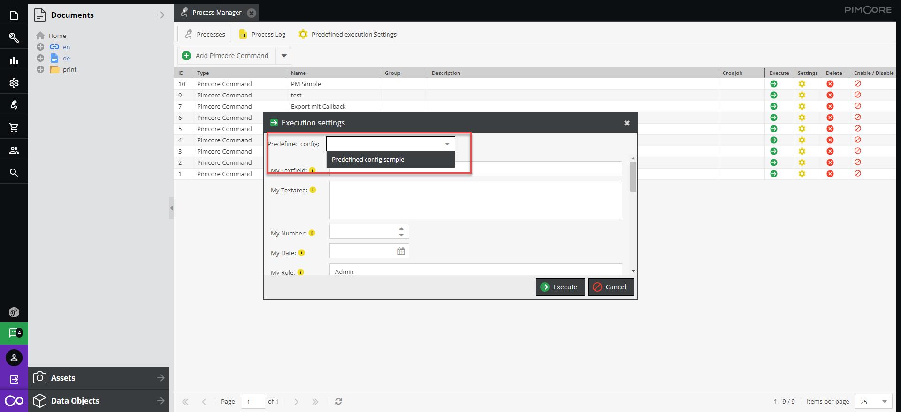

# Callbacks (Configuration windows)

Callbacks are configuration windows/forms which are displayed before a process is executed. 
This allows the user to configure certain runtime options/settings. 
When the user clicks on the execute button the callback window will open. The user will fill out the data and when he clicks on "Execute", the process is started and the filled in data
can be retrieved in the script later on.



The selected values are stored in the monitoring item and can be retrieved by calling 

```php
$callbackSettings = $monitoringItem->getCallbackSettings();
```

The callback window which should pop up can be defined in the process settings:


## Predefined execution Settings
In the "Predefined execution Settings" tab you can create predefined configurations for your callback windows.


When you execute the "regular job", you can select these settings with the "Predefined config" field.  

# Creating your own callbacks

To create a callback you have to add a definition in the /app/config/pimcore/plugin-process-manager.php (section "executorCallbackClasses")


```php
[
            "name" => "exportProducts",
            "class" => "\\Elements\\Bundle\\ProcessManagerBundle\\Executor\\Callback\\General",
            "extJsClass" => "pimcore.plugin.PLUGINNAME.processmanager.executor.callback.exportProducts",
]
```
Most of the time you will add a definition like the one above and just alter the "extJsClass" + "name".
The "name" should be unique and the "extJsClass" have to be loaded by your own extension. 

The ExtJs Class should extend the pimcore.plugin.processmanager.executor.callback.abstractCallback and implement a "getFormItems" method which returns the configuration fields.
Please take a look at the [callback/example.js](../src/Resources/public/js/executor/callback/example.js) file which should give you a good starting point.

The abstract callback Class implements certain helpers to easily add new form elements. 